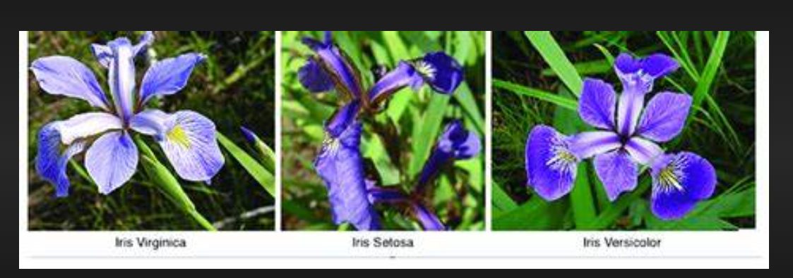

 
#  Iris EDA & KNN Classification

##  Overview
This project focuses on performing Exploratory Data Analysis (EDA) and applying the K-Nearest Neighbors (KNN) algorithm on the classic Iris dataset.  
The main goal is to explore data patterns, reduce dimensionality using PCA, and build a classification model that predicts the species of Iris flowers.

##  Project Workflow

### 1️) Exploratory Data Analysis (EDA)
- Univariate Analysis:  
  Used histograms, boxplots, and countplots to understand the distribution of individual features.  
  Example: Distribution of sepal length, petal width, etc.

- Bivariate Analysis:  
  Explored relationships between pairs of features using scatterplots and pairplots.  
  Example: Relationship between petal length and petal width.

- Multivariate Analysis:  
  Visualized all features together to observe class separability using heatmaps and pairwise correlations.

### 2️) Dimensionality Reduction (PCA)
- Applied Principal Component Analysis (PCA) to reduce dimensions and visualize data in 3D scatter plots.
- Observed how different Iris species cluster in lower dimensions.

### 3️) Model Building (KNN Algorithm)
- Split the data into training and testing sets.
- Applied K-Nearest Neighbors (KNN) algorithm for classification.
- Tuned the value of `k` to achieve optimal accuracy.
- Evaluated model performance using:
  - Accuracy Score
  - Confusion Matrix
  - Classification Report

---

##  Key Visualizations
- Histograms & Boxplots (Feature Distributions)
- Pairplots & Heatmaps (Feature Relationships)
- PCA 2D & 3D Scatter Plots
- KNN Classification Results

---

##  Technologies & Libraries Used
- **Python**
- **NumPy**
- **Pandas**
- **Matplotlib**
- **Seaborn**
- **Scikit-learn**

##  Results
- Successfully visualized feature relationships and species separation.
- Achieved high accuracy using the **KNN classifier**.
- Demonstrated clear clusters in PCA visualization.
## Read full medium blog https://medium.com/@mdurgavani99/exploring-the-iris-dataset-eda-pca-and-knn-classification-step-by-step-f2c3b5b3cd94
---

